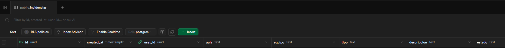
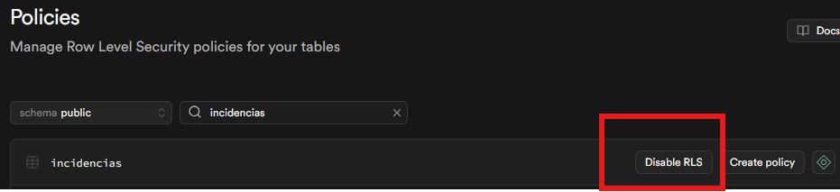
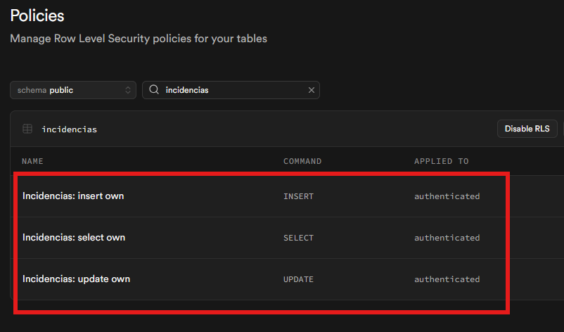
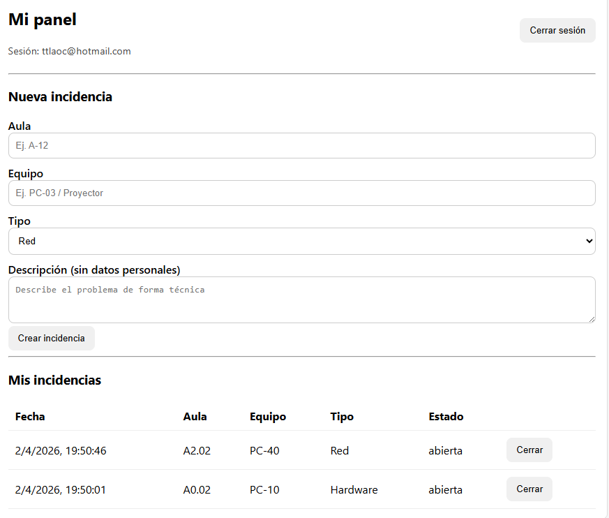
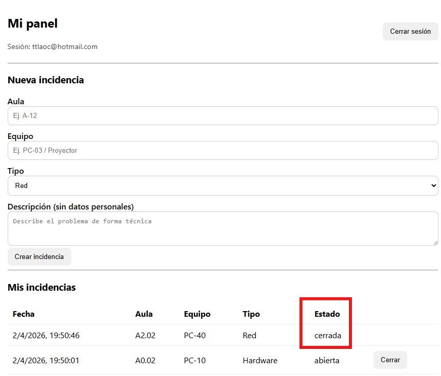

# Incidencias TIC (Cloud)

## Enlaces
- Repo: [Repositorio de GitHub con el código y los recursos](https://github.com/ttlaoc/incidencias-tic.git)
- GitHub Pages: [Enlace a la página del sistema](https://ttlaoc.github.io/incidencias-tic/)

## Evidencias (capturas)
<!-- Puedes añadir una imagen (captura de pantalla) del siguiente modo (sustituye "alt text" por un texto alternativo
para que tu documento gane accesibilidad. El ejemplo supone que las imágenes las guardas en la carpeta "res"):  -->
<!-- En Visual Studio Code puedes previsualizar un archivo markdown pulsando con botón derecho del ratón y seleccionando "Open preview"-->
1) Tabla `incidencias` (estructura):

2) RLS activado (se puede mirar en el editor de tablas de Supabase, pregunta a tu LLM favorito):

3) Policy (SELECT/INSERT/UPDATE) (se puede mirar donde mismo, pregunta a tu LLM favorito):

4) App funcionando (crear y listar). En la captura se debe ver tu correo:

5) App funcionando (cerrar incidencia). En la captura se debe ver tu correo:

## CE.f — Procedimiento de almacenaje cloud
- Servicio cloud usado: Supabase (Postgres + Auth + RLS)
- Estructura de tabla:
- Autenticación:
- Permisos (RLS + policies):
- Conexión desde la app (URL + ANON KEY, supabase-js):

## CE.g — Importancia del cloud (beneficios)
- Productividad:
- Seguridad:
- Coste:
- Escalabilidad y disponibilidad:

## RA5 — Riesgos y medidas
### Riesgos (3)
1)
2)
3)

### Medidas (5)
1)
2)
3)
4)
5)